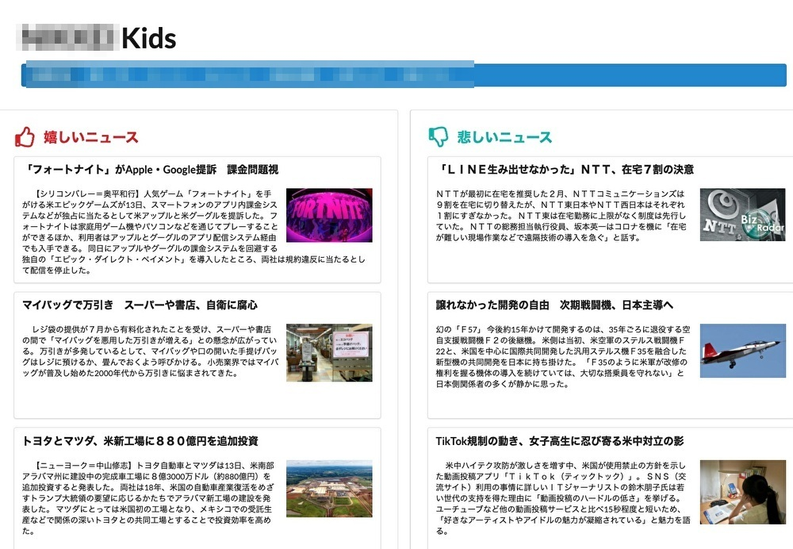
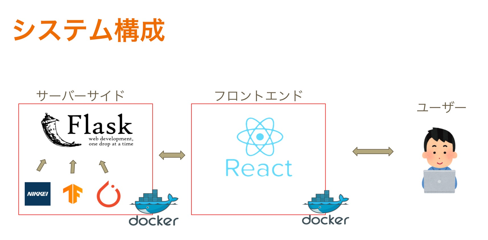
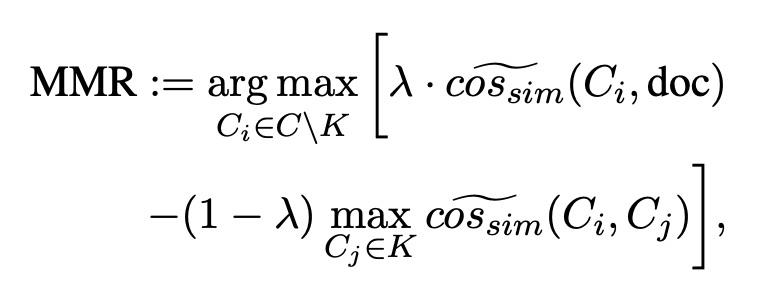
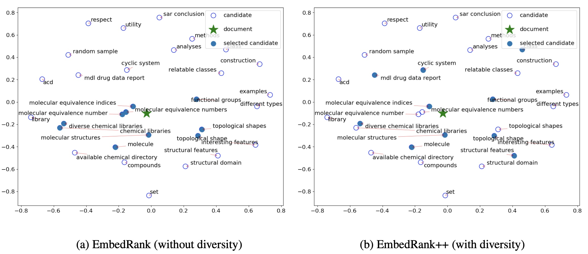
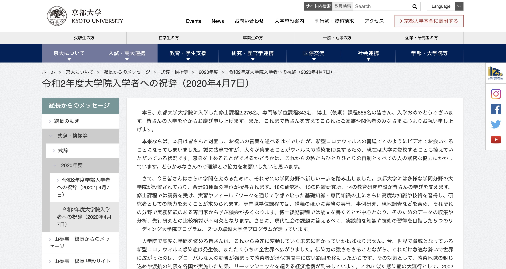

## 参加するまで



今回のインターンシップでは企業さんが保有している膨大なデータを自由に利用して，新規事業を立案してサービス開発（？）まで行い，最後に全体に向けて発表するという内容でした．

ちなみに僕は今修士1年で自然言語処理に関する研究をしています．また，趣味でwebサービス開発をしたり，友人と共同で立ち上げたプロジェクトでフロント開発した経験はありますが，企業での実務経験はありません．

- 膨大なデータをいじれる．
- 普段研究で触れている機械学習がビジネスの世界でどう使われているか気になる．
- 某データコンペティションで有名な方とお話しできる．

こんな点に魅力を感じエントリーしました．

## 作ったサービス
さて，今回僕のチームが開発したサービスはまとめるとこんな感じ．

ネットニュースの読者の年齢層は比較的高く，若年層はあまり読まないようだったので，若い人（小学生 - 高校生）にも読んで欲しいということで **「わかりやすい版ネットニュース」** みたいなものを作りました．

システム構成も図示しておきます．

- 開発環境
  - docker
- フロントエンド
  - React
  - semantic UI
- バックエンド
  - Flask
- 自然言語処理
  - doc2vec (TensorFlow)
  - textCNN (PyTorch)

2人でサービス開発に取り組み，僕はdockerで開発環境構築，自然言語処理の要約部分実装，フロントエンド実装を担当しました．人が構築したdocker環境を利用した経験はあるのですが，自分で構築するのは初めてだったので，何度もつまづきました．

## 要約機能実装
モチベーションとして，普段ニュースを読まない人にもわかりやすく，取得したニュースを3行（くらい）にまとめて簡潔で読みやすいものに変換します．

要約技術は対象の記事から複数文抽出する **抽出型要約** と，新しい文をゼロから生成する **生成型抽出要約** があります．今回は時間もあまりなかったので，抽出型要約にチャレンジしてみることにしてみました．

- [A Redundancy-Aware Sentence Regression Framework for Extractive Summarization (COLING)](https://www.aclweb.org/anthology/C16-1004/)
- [Learning Summary Prior Representation for Extractive Summarization (ACL)](https://pdfs.semanticscholar.org/0f6d/8e5d9b243eaf1d3968d8cd272db64e536beb.pdf)
- [PEGASUS: Pre-training with Extracted Gap-sentences for Abstractive Summarization](https://arxiv.org/abs/1912.08777)
- [抽出型文書要約における分散表現の学習](https://www.anlp.jp/proceedings/annual_meeting/2017/pdf_dir/P7-4.pdf)

こんな論文を見つけながら，記事全体と抽出する文との距離感測って最も近い文をそのまま要約に使えばいいかと考えたのですが，社員さんに<br>
 *「抽出してきた文動詞も比較すると良い」* <br>
 といったアドバイスをもらったので，さらにサーベイを進めました．

 すると，**EmbedRank++** と呼ばれる手法を見つけました．（[元ネタ論文](https://arxiv.org/pdf/1801.04470.pdf)）

記事のベクトルとの距離が近い文を単純に選択する手法だと，同じような文が集まってしまうので，これを防ぎ多様性を保つ為に[MMR](http://citeseerx.ist.psu.edu/viewdoc/download?doi=10.1.1.188.3982&rep=rep1&type=pdf)と呼ばれる手法を取り入れます．したがって，

> 記事ベクトルと抽出文の類似度を正のスコア，既に抽出した文との類似度を負のスコアとして合計値を元にランキングする

という考えを参考にしました．式は以下です．



以下の図を見ると想像しやすいと思います．（[参考文献](https://www.aclweb.org/anthology/K18-1022.pdf)）<br>
**「記事のベクトルに近い && 満遍なく取りたいね」** というお気持ちがあります．



続いて，プログラムも載せておきます．まずはベクトルかの部分です．[Universal Sentence Code](https://arxiv.org/pdf/1803.11175.pdf)という手法で公開されているTensorFlowのモデルがあったのでこれを使いました．ちなみにこれは英語と日本語の比較など異なる言語間の比較もできるみたいです．

```python
import tensorflow_hub as hub
import numpy as np
import tensorflow_text

import ssl
ssl._create_default_https_context = ssl._create_unverified_context

# ベクトル化する関数
embed = hub.load("https://tfhub.dev/google/universal-sentence-encoder-multilingual/3")
```
<br>

コサイン類似度はそのまま．
```python
def cos_sim(v1, v2):
    return np.dot(v1, v2) / (np.linalg.norm(v1) * np.linalg.norm(v2))
```
<br>
MMRのプログラムを以下に示しているのですが，正のスコアである記事ベクトルと抽出文との類似度と，負のスコアである既に抽出した文と抽出文候補との類似度の比率は8:2としてみました．この比率を変えながら結果がどう変わるか気になるので時間があるときに試してみようと思います．

```python
def mmr(doc_emb, cand_embs, key_embs):
    param = 0.8
    # 候補文一つ一つと記事全体との類似度測定
    scores = [param * cos_sim(cand_emb, doc_emb[0]) for cand_emb in cand_embs]
    # 抽出済みの文との近さはペナルティ
    if key_embs is not None:
        for key_emb in key_embs:
            scores -= (1-param) * cos_sim(cand_embs, key_emb)
    return scores
```
<br>

続いて，記事のベクトルと記事内のそれぞれの文のベクトル，抽出数の3つを入力値とし，抽出すべき文のインデックスを出力する関数です．
```python
def embedrankpp(doc_emb, sent_embs, n_keys):
    assert 0 < n_keys, 'Please `key_size` value set more than 0'
    assert n_keys < len(sent_embs), 'Please `key_size` value set lower than `#sentences`'
    # 全ての文のインデックスをリストで管理
    cand_idx = list(range(len(sent_embs)))
    # 抽出する文のインデックスをリストで管理
    key_idx = []
    while len(key_idx) < n_keys:
        # 全ての候補文のembedding管理
        cand_embs = [sent_embs[idx] for idx in cand_idx]

        # 抽出する文のembedding管理
        key_embs = [sent_embs[idx] for idx in key_idx] if len(key_idx) > 0 else None

        # mmrを用いたスコア評価
        scores = mmr(doc_emb, cand_embs, key_embs)

        # 一番スコアの高い文のインデックスを追加
        key_idx.append(cand_idx[np.argmax(scores)])

        # 抽出した文は候補から外す
        cand_idx.pop(np.argmax(scores))

    return key_idx
```

では，せっかくなのでこの要約プログラムの精度を実際に見てみましょう！

**今回は例として京都大学のホームページにある総長からのメッセージにある「令和2年度大学院入学者への祝辞」をサクッと3文に要約してみます！！！！！**



「こんなに長文読めるかい，短くまとm...（おっと誰か来たようだ）」

さぁこの7888文字の超大作要約すると．．．

> 科学技術の粋を凝らして国を発展させたはずの日本が、今数々の自然災害に苦しんでいます。このように、科学技術も新しいエネルギーを開発して人間の利便性をただ拡大するのではなく、地球環境との共存という方向に舵を切り始めています。社会や産業界が研究者に求める課題はますます多くなることが予想されますが、京都大学は社会にすぐ役立つ研究だけを奨励しているわけではありません。

本来，こういった祝辞の要約（挨拶を要約すること自体間違えですが）では，3文にまとめるなら最初の一文と最後の一文とこれらを繋ぐ一文で，それらしい要約が完成しそうですが，記事全体のベクトルと比較するというアルゴリズム上，記事ベクトルを構成する大きな要因（具体例含めた挨拶文？）に引っ張られた結果を出力してしまっているのかなと思います．単純なベクトル化だけでなく，こういったことを考慮できると要約としての精度は上がりそうですね．


## その他の言語処理タスク
### 平易化
前章で要約した文章を簡単な日本語表現に変換していきます．

長岡技術大学の[やさしい日本語コーパス](http://www.jnlp.org/SNOW/T15)というデータがあったのでこれを使ってSeq2Seqで変換させてしまおうと考えたのですが，いまいちな結果に．
<br>
おそらくデータセット内の語彙に対してニュースの記事は専門用語が多く含まれており，ドメインが大きく違うことが原因だったのかなと考えています．用語の言い換えについても上位語に言い換える方法を考えたのですが，特定の用語が抽象的に言い換えられることで，ニュースは返ってわかりにくくなってしまいました．
<br>
今回は日本語表現の平易化の自力実装は諦めることにしました．

### 感情分析
続いて，ニュースを「嬉しいニュース」と「悲しいニュース」に分類タスクです．
感情分析にはまず[oseti(既存のやつ)](https://github.com/ikegami-yukino/oseti)を使ってみました．ニュース記事のを処理にかけてみると，なんとも言い難い精度だったので，チームメイトがtextCNNを用いて実装してくれました．データセットは[chABSA-dataset](https://github.com/chakki-works/chABSA-dataset)というのを利用してくれていたみたいです．


## まとめ
### 感想
今年はいくつかの企業さんのインターン(web×2, 機械学習×2)に参加させていただきますが，一発目のインターンが終了しました．

記事をわかりやすく要約し，感情分析して表示する一通りのタスクを実装し，デモとして完成させることができました．5日間でアイディアを絞り出し，環境を構築して，フロントエンド，バックエンド，自然言語処理の数多くのタスクに取り組むことはなかなかハードでしたが，とても貴重な経験となりました．自分の実装した自然言語処理技術がフロントでレンダリングできた瞬間は少し達成感がありました．

dockerによる環境構築はほぼ初めての経験で何度もエラーが生じて解決せず，心が折れそうになりましたが，たくさんの社員さんにフォローしていただき解決できました．（無知な自分に優しくご教授くださりありがとうございました．）

インターンシップは5日間という短い期間でしたが，とても充実し有意義に過ごすことができました．

### 要約
最後にこのブログの記事もまるっと要約してしまいたいと思います．

> 要約技術は対象の記事から複数文抽出する 抽出型要約 と，新しい文をゼロから生成する 生成型抽出要約 があります．こんな論文を見つけながら，記事全体と抽出する文との距離感測って最も近い文をそのまま要約に使えばいいかと考えたのですが，社員さんに 「抽出してきた文動詞も比較すると良い」 といったアドバイスをもらったので，さらにサーベイを進めました．本来，こういった祝辞の要約（挨拶を要約すること自体間違えですが）では，3文にまとめるなら最初の一文と最後の一文とこれらを繋ぐ一文で，それらしい要約が完成しそうですが，記事全体のベクトルと比較するというアルゴリズム上，記事ベクトルを構成する大きな要因に引っ張られた結果を出力してしまっているのかなと思います．

うーん，まだまだ改善の余地はありそうですね．

