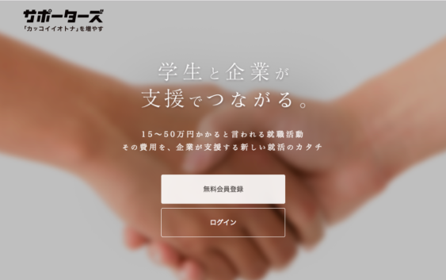
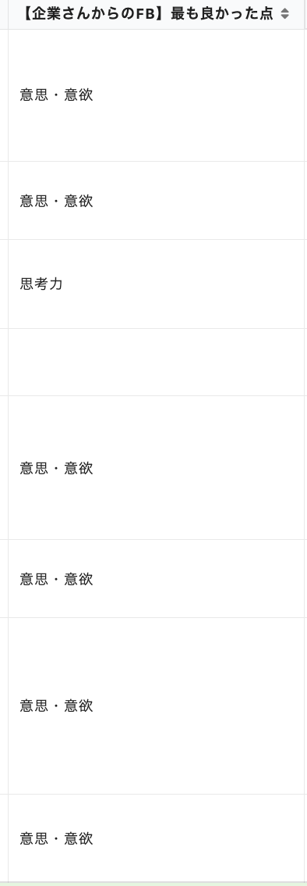

大学院に進学しました．

私は技術力がまだまだ低く，胸張って人に紹介できるような制作物はなければ，特にエンジニアのバイト経験があるわけでもないので，就活が本当に恐ろしいです．そんな中エンジニアの逆面接イベントという広告をたまたまTwitterで見かけました．僕が見かけたのはサポーターズというエンジニアのキャリア支援を行っている会社のイベントです．

  [サポーターズ](http://supporterz.jp/lp/career_support/:embed:cite)

# 逆面接1on1
 
今回のイベントは，8社の企業さんと順番に面談してエンジニアのキャリアについてお話できるような形式でした．公式サイトから引用します．

> 皆さんの行ってきた研究経験・プログラミング経験を企業さんに聞いていただき
企業・社会の中でその経験をどのように活かすことができるかという点をお話しいただきます。
また、エンジニアとしてどのようなキャリアを歩んでいけばいいかを人事さん、現役エンジニアさんからアドバイスいただけることもあります。
面接ではないため、ここで選考NGとなることはなく気負わずに参加いただいてOKです。

私自身将来エンジニアとしてのキャリアを歩むにあたって，現場で働くエンジニアの方々の話を聞いてみたいと思って申し込みました．

 

# 事前準備
 
このサポーターズの逆面接イベントはどうやら全員が参加できるわけではなく，参加するにあたって選考がありました．おそらく，今取り組んでいることや研究，さらには今まで開発してきた成果物を見られ，エンジニアとしての技術力が最低限あるかどうかを判断されています．僕は自信がなかったので選考で落とされるかなと思ってました（）

<blockquote class="twitter-tweet">
よわよわなのにサポーターズの1on1通ってしまった… 色々話せるのは楽しみ
&mdash; k3nt (@k3ntrr) <a href="https://twitter.com/k3ntrr/status/1255440749094715395?ref_src=twsrc%5Etfw">April 29, 2020</a></blockquote> 

参加するにあたって，準備しなければならないことがどうやら2つあるようです．

* サポーターズの自分のアカウントのプロフィールを埋めること(企業さんが見るので)

* 自己紹介スライドを作ること

自己紹介はプログラミングを始めたきっかけ，留学した時の話や作っているサービスの話などを中心にしました．

<iframe src="//www.slideshare.net/slideshow/embed_code/key/KTxOafVWJ6wRrw" width="595" height="485" frameborder="0" marginwidth="0" marginheight="0" scrolling="no" style="border:1px solid #CCC; border-width:1px; margin-bottom:5px; max-width: 100%;" allowfullscreen> </iframe> 
 <strong> <a href="//www.slideshare.net/Kent/self-introduction-234107402" title="Self introduction" target="_blank">Self introduction</a> </strong> from <strong><a href="https://www.slideshare.net/KentoTanaka4" target="_blank">KentoTanaka4</a></strong> 

# 逆面接イベント
## 当日の流れ
今回はコロナの影響で全てオンラインでの開催でした．本来であれば京都(or 東京?)での開催だったみたいですが仕方ないっすね．このイベント朝10時から始まって夜の20時頃まで続くのでめちゃくちゃ長くてひたすら疲れます．タイムスケジュールはこんな感じでした．

|  時間  |  コンテンツ  |
| ---- | ---- |
|  10:00   |  スタート  |
| 10:00-10:30  |  学生ガイダンス  |
|  10:30-12:40  |  企業プレゼン  |
| 12:40-13:40  |  面談希望反映タイム  |
|  13:40-   |  午後の学生ガイダンス  |
| 13:55-14:20  |  第1ターン  |
|  13:55-14:20  |  第2ターン  |
| 15:15-15:40  |  第3ターン  |
|  15:55-16:20   |  第4ターン  |
| 16:50-17:15  |  第5ターン  |
|  17:30-17:55   |  第6ターン  |
| 18:10-18:35  |  第7ターン  |
|  18:50-19:15   |  第8ターン  |
| 19:25-20:15  |  懇親会  |

 
スケジュール見てわかると思うんですが，とにかく予定が詰め詰めなんですよね．各ターンの間面談の感想を書かないといけないので，休憩時間はほぼありませんでした．そして，オンライン開催なんでパソコンに向かって話すだけだし，なんとかなるでしょと思ってたんですが，ありえないくらい疲れました．やっぱり，相手が企業の人事さんだったりするんで，気を張るので続くと応えるものがあります．

## 面談が始まって
面談する企業さんは事前に提出している面談したい企業さんの調査と，企業さんが面談したい学生の調査に従って，マッチングさせて面談が組まれていくようです．僕は今回以下の企業のエンジニアや人事に方々とお話しすることができました．（敬称略）

* GA technologies
* ミクシィ
* 日本マイクロソフト
* アクセンチュア
* アカツキ
* マネーフォワード
* VOYAGE GROUP
* 楽天

興味のある企業さんと1日に8社一気にお話しできる機会なんてそうないと思います．本当にサポーターズ様様です．面談ははじめに用意した自己紹介スライドを使って自己アピールして，それに対して企業の方が質問をくれたり，逆に企業さんに質問をしたりといった流れで進みました．僕は自慢できる技術力はなかったので，なんでプログラミングを始めたのか，どんなエンジニアになりたいのかといった自分の経緯や将来の夢をしっかり伝えようと思って，高校生の頃から遡ってストーリー立てて話すことを意識しました．すると，面談終わりに各企業の方からFBがもらえるのですが，見事に「意思・意欲」という項目が並びました笑．  
 
多くの企業さんは「自分の軸がしっかりあって偉い」や「サービス作っててスゴイ」など，優しくたくさん褒めていただいたので，とても楽しくお話することができました．
<blockquote class="twitter-tweet">
エンジニア逆面接折り返し地点、端的な感想としては話めっちゃ聞いて貰えるので意外と楽しい
&mdash; k3nt (@k3ntrr) <a href="https://twitter.com/k3ntrr/status/1261559610135072769?ref_src=twsrc%5Etfw">May 16, 2020</a></blockquote> 

外資系の企業には以前から興味があり，外資の企業の方には考え方が外資系向きだねと言われたことは嬉しかったです．また，PMやコンサルの職でも戦えるかもねと言ってくださる企業の方も多く．今はものづくりが好きですが，エンジニアだけに拘わる必要もないのかなと，ビジネスサイドも興味はあるので，もっと視野を広く考えるようになりました．

# まとめ
イベントを通して，やっぱり緊張してしまっていたので終わってからどっと疲れが来ました．
<blockquote class="twitter-tweet">
逆面接無事終了…  1日座ってたので腰砕けそう、ブログ書くかぁ
&mdash; k3nt (@k3ntrr) <a href="https://twitter.com/k3ntrr/status/1261612570974158848?ref_src=twsrc%5Etfw">May 16, 2020</a></blockquote> 
とは言え，こんな機会滅多にないので，本イベントを企画してくださった方，お話ししてくださった企業の方々には本当に感謝です．そして，このイベントには企業の方が気になる学生に特別選考なるスペシャルオファーというものを渡すことがあるとのことだったんですが，なんと自分も数社からいただいてしまいました．え，自分でいいんすかとは思ったんですが，後日面談しようとのことでまたお話しできるのが楽しみです．インターンの選考中の企業さんは選考中のステップを1つパスさせてもらえたり，スペシャルオファーをもらうとサポーターズから別で支援金を頂けたりするので，とにかく良いことづくしの1日でした．なので，技術力なくてよわよわな学生エンジニアも自信を持って逆面接イベント参加してみてください！では．
 
 
