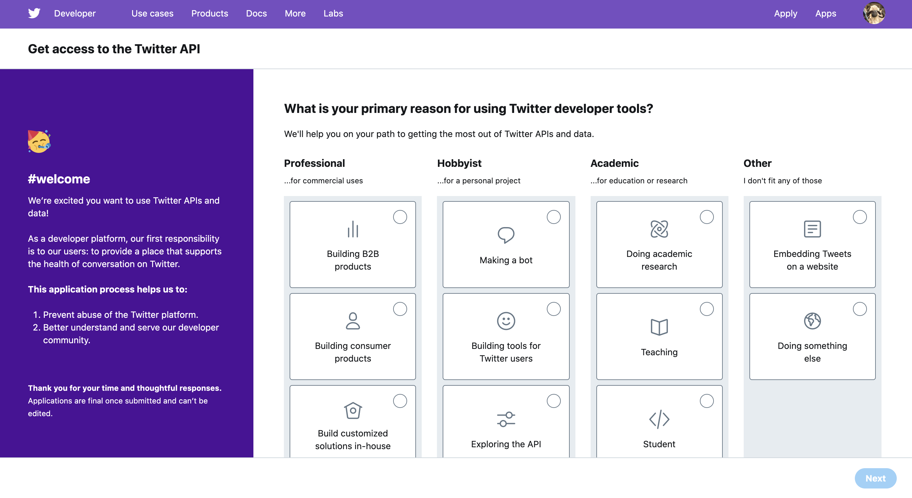
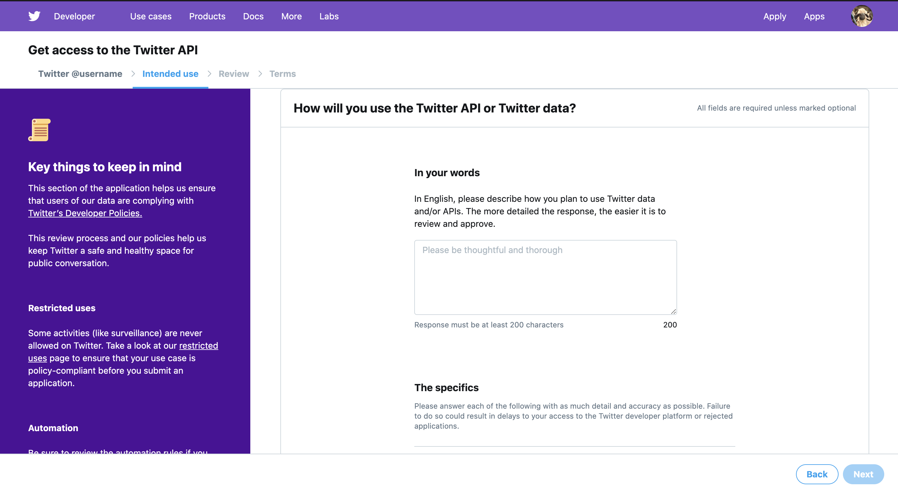
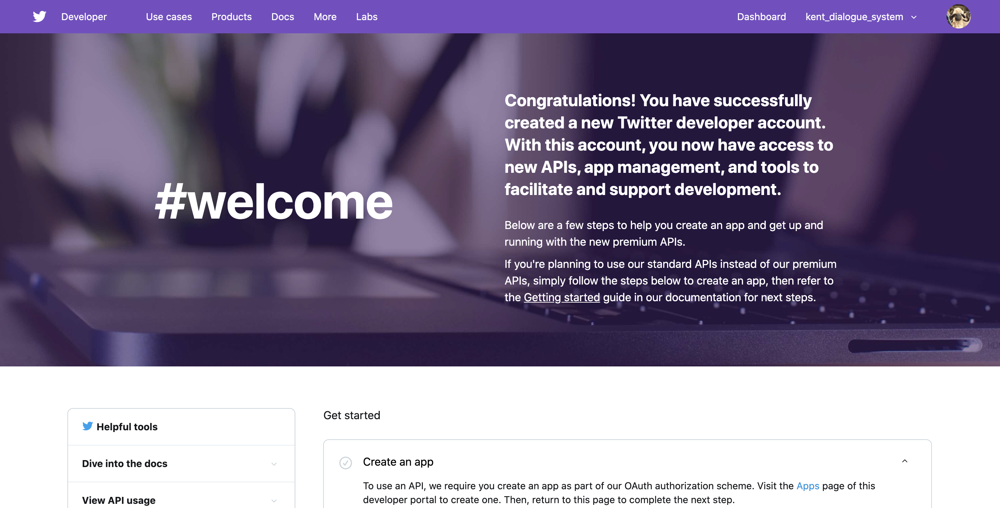
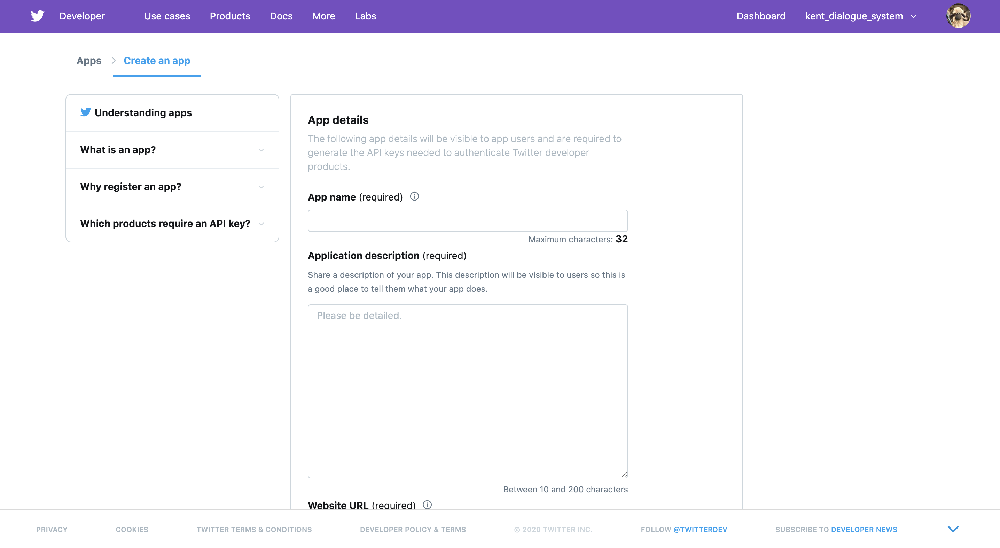

前回の記事では対話システムを考えるにあたって，その評価の方法についてまとめてみました！

今回は実際にtwitterのデータ対話システムを作っていきたいと思います！

## はじめに
近年，Apple社のSiriやAmazon社のAlexaといった，人間とコンピュータが自然言語を用いて会話ができる対話システムの研究が注目されています．対話システムは，状況を理解し，相手の意図を理解して，次の発言を考えることが求められており，これら対話システムは大別して，所定のタスクを遂行することを目的にしているか否かにより，タスク指向型と非タスク指向型に分類することができます．

タスク指向型は所定のタスクを遂行することを目的としており，天気情報案内システムや，フライト予約システム，レストラン検索システムなどが例に挙げられます．一方で，所定のタスクを遂行することを主な目的としない対話システムは非タスク指向型対話システムと呼ばれ，雑談対話システムとも呼ばれています．

今回は，非タスク指向型の対話システムの実装をしていこうと思うのですが，対話システムの実装方法を大きく3つに分けると，「ルールベース」，「用例ベース」，「生成ベース」があります．ルールベースは最もシンプルな方法で，対話システムは，ユーザの発話を受け取り，それに対して適切な応答をルールや過去の対話例などに従って決定するものです．また，用例ベースでは，大量に集められた用例と呼ばれる人間同士の会話のデータの中から，適切な用例を高速に見つけ出す方法です．そして，生成ベースは過去のデータから再利用するのではなく1から発話を作り上げるもので，ニューラルネットを用いた機械翻訳の技術を対話に応用したものです．

現存の対話システムとの会話はどこか不自然で円滑性が見られないと思うのですが．これは多くのシステムが規則に基づいて発話や応答を決定しているからあると言えます．人同士の会話に見られる「ユーモア」が欠如しているのです．いかにして対話システムにユーモアを見出すか，これは今後の課題であると同時に最も難しいタスクの一つとなると考えられます．本研究では，Twitterから収集したデータと上記で述べた生成ベースの手法を用いて，より社交性があり，円滑な対話システムを実装することを目標とします．

## twitterデータの収集
twitterはtwitter内の情報にアクセスできるAPIを公開していて，利用する為にまずは登録する必要があります．
（画像をクリックすると該当ページに飛びます）

[](https://developer.twitter.com/en/application/use-case)

ここでは 'Do something else' を選択し，Nextをクリックします．
次に以下のようなページに移るので，ここでは国を選択して自分のアプリの名前を入力し，Nextをクリックしてください．


次の画面では，twitterのデータやAPIをどういった目的で利用するのか説明する必要があります．
200字以上の英語で記入しましょう．これはある程度丁寧に書く必要があり，適当に書くと審査を通らないので気を付けましょう．



利用の用途を書いて下にスクロールすると以下のように表示されるのですが，データを収集することだけが目的であれば全てNoに選択すればOKです．


次にNextをクリックすると確認画面に移るので，確認したら 'Looks good!' をクリックし，登録したメールアドレス宛てに届くリンクをクリックすれば完了です．

ここまででアカウントの登録が完了したので，次にアプリの情報を入力していきます．'Create an app' をクリックし，アプリの名前や詳細を書き，'Create' をクリックします．





最後に使用上の注意事項などが表示されるので，全て確認した後に，'Create' をクリックしアプリの登録を完了させます．すると，API keyとAPI secret key ，さらには，access token と access secret が表示されるのでこれらを控えます．

では，APIキーとトークンが手に入ったので以下のプログラムを動かしてtwitterデータを集めていきます．

```python
import tweepy
import random
import re


while True:
    # ここに先程取得したAPIキーとトークンを入力
    api_key = setting.api_key
    api_secret_key = setting.api_secret_key
    access_token = setting.access_token
    access_token_secret = setting.access_token_secret

    auth = tweepy.OAuthHandler(api_key, api_secret_key)
    auth.set_access_token(access_token, access_token_secret)
    # wait_on_rate_limit は制限がリセットされるまでプログラムを休止するオプション
    api = tweepy.API(auth_handler=auth, wait_on_rate_limit=True)

    # botのツイートを除外するため，一般的なクライアント名を列挙
    sources = ["TweetDeck", "Twitter Web Client", "Twitter for iPhone",
               "Twitter for iPad", "Twitter for Android", "Twitter for Android Tablets",
               "ついっぷる", "Janetter", "twicca", "Keitai Web", "Twitter for Mac"]


    # ひらがな一文字で検索し，スクリーンネームを取得
    words = list("あいうえおかきくけこさしすせそたちつてとなにぬねのはひふへほまみむめもやゆよらりるれろわをん")

    screen_names = set()
    # ランダムで選択した平仮名1文字を含むツイートを検索
    # 日本語を対象とし、検索毎に異なるツイートを取得するため
    for s in api.search(q=random.choice(words), lang='ja', result_type='recent', count=100, tweet_mode='extended'):
        if s.source in sources:
            # ツイートを行ったユーザのスクリーンネームを取得
            screen_names.add(s.author.screen_name)

    # ステータスidからステータスを得るためのdict
    id2status = {}

    # スクリーンネームからタイムラインを取得してツイートを保存．
    # さらにリプライツイートであれば，リプライ先のスクリーンネームも取得
    in_reply_to_screen_names = set()
    for name in screen_names:
        try:
            for s in api.user_timeline(name, tweet_mode='extended', count=200):
                # リンクもしくはハッシュタグを含むツイートは除外する
                if "http" not in s.full_text and "#" not in s.full_text:
                    id2status[s.id] = s
                    if s.in_reply_to_screen_name is not None:
                        if s.in_reply_to_screen_name not in screen_names:
                            in_reply_to_screen_names.add(s.in_reply_to_screen_name)
        except Exception as e:
            continue

    # リプライ先のスクリーンネームからタイムラインを取得してツイートを保存
    for name in in_reply_to_screen_names:
        try:
            for s in api.user_timeline(name, tweet_mode='extended', count=200):
                if "http" not in s.full_text and "#" not in s.full_text:
                    id2status[s.id] = s
        except Exception as e:
            continue

    # 保存したツイートのリプライ先のツイートが保存されていれば，id2replyidのキーを元ツイートのid，値をリプライ先ツイートのidとする
    id2replyid = {}
    for _, s in id2status.items():
        if s.in_reply_to_status_id in id2status:
            id2replyid[s.in_reply_to_status_id] = s.id


    # id2replyidのkey valueからstatusを取得し，ツイートペアをタブ区切りで保存
    f = open("tweet_pairs.txt", "a")
    for id, rid in id2replyid.items():
        # 改行は半角スペースに置換
        tweet1 = id2status[id].full_text.replace("\n", " ")
        # スクリーンネームを正規表現を用いて削除
        tweet1 = re.sub(r"@[0-9a-zA-Z_]{1,15} +", "", tweet1)

        tweet2 = id2status[rid].full_text.replace("\n", " ")
        tweet2 = re.sub(r"@[0-9a-zA-Z_]{1,15} +", "", tweet2)

        f.write(tweet1+ "\t" + tweet2 + "\n")
    f.close()
    print("Write " + str(len(id2replyid)) + " pairs.")


    # ツイート3組をタブ区切りで保存
    # f = open("tweet_triples.txt", "a")
    # for id, rid in id2replyid.items():
    #     if rid in id2replyid:
    #         tweet1 = id2status[id].full_text.replace("\n", " ")
    #         tweet1 = re.sub(r"@[0-9a-zA-Z_]{1,15} +", "", tweet1)

    #         tweet2 = id2status[rid].full_text.replace("\n", " ")
    #         tweet2 = re.sub(r"@[0-9a-zA-Z_]{1,15} +", "", tweet2)

    #         tweet3 =  id2status[id2replyid[rid]].full_text.replace("\n", " ")
    #         tweet3 = re.sub(r"@[0-9a-zA-Z_]{1,15} +", "", tweet3)
    #         f.write(tweet1 + " SEP " + tweet2 + "\t" + tweet3 + "\n")
    # f.close()
```

## Google Colabによる学習
ここからは実際に収集したデータを使って対話システムを実装していきます．今回は機械翻訳のライブラリであるOpenNMTを使っていきます．学習する上で，GPUを支える環境がある人はGPUを用いると学習が早く終わりますが，ない人はGoogle Colab上で実行しましょう．（Google Colabは無料でGPUをブン回せます）

まず，収集したデータをOpenNMTで支える形にします．

```python
import MeCab
import os

# データ数を設定
TRAIN_PAIR_NUM = 1200000
DEV_PAIR_NUM = 10000
TEST_PAIR_NUM = 10000

mecab = MeCab.Tagger ("-Owakati")
mecab.parse("")

source = []
target = []
with open("tweet_pairs.txt") as f:
    for i, line in enumerate(f):
        line = line.strip()

        if "\t" in line:
            s = mecab.parse(line.rsplit("\t", 1)[0].replace("\t", " SEP "))
            t = mecab.parse(line.rsplit("\t", 1)[1])
            # 両方とも5単語以上のツイートリプライペアを使用
            if len(s) >= 5 and len(t) >= 5:
                source.append(s)
                target.append(t)
        # 設定したデータ数に達したら読み込みを終了
        if len(source) > DEV_PAIR_NUM + TEST_PAIR_NUM + TRAIN_PAIR_NUM:
            break

# 出力用のディレクトリを作成
os.makedirs("OpenNMT", exist_ok=True)

# ファイル出力
with open("OpenNMT/dev.src", "w") as f:
    for l in source[0:DEV_PAIR_NUM]:
        f.write(l)
with open("OpenNMT/dev.tgt", "w") as f:
    for l in target[0:DEV_PAIR_NUM]:
        f.write(l)
with open("OpenNMT/test.src", "w") as f:
    for l in source[DEV_PAIR_NUM:DEV_PAIR_NUM + TEST_PAIR_NUM]:
        f.write(l)
with open("OpenNMT/test.tgt", "w") as f:
    for l in target[DEV_PAIR_NUM:DEV_PAIR_NUM + TEST_PAIR_NUM]:
        f.write(l)
with open("OpenNMT/train.src", "w") as f:
    for l in source[DEV_PAIR_NUM + TEST_PAIR_NUM:DEV_PAIR_NUM + TEST_PAIR_NUM + TRAIN_PAIR_NUM]:
        f.write(l)
with open("OpenNMT/train.tgt", "w") as f:
    for l in target[DEV_PAIR_NUM + TEST_PAIR_NUM:DEV_PAIR_NUM + TEST_PAIR_NUM + TRAIN_PAIR_NUM]:
        f.write(l)
```

上記のプログラムは最初のプログラムで集めたデータ（ペアのツイート）をMeCabを用いて分かち書きにし，学習用ファイルや試験用ファイルなど用途によって分けて保存しています．

Google Colabでデータを読み込む為にGoogle Driveに上記プログラムで生成されたOpenNMTのフォルダを入れます．

では実際にデータを用いて学習させていきましょう．

OpenNMTをgithubからダウンロードし，必要なライブラリをインストールします．
```bash
!git clone https://github.com/OpenNMT/OpenNMT-py
!cd OpenNMT-py; pip install OpenNMT.py
```

次にGoogle Driveにアクセスできるように設定します．
```bash
from foofle.colab import drive
drive.mount('./drive')
```

まず学習データの前処理を行い，その次に学習を実行します．
```bash
!python OpenNMT-py/preprocess.py -train.src "drive/My Drive/dsbook/OpenNMT/train.src" -train_tgt "drive/My Drive/dsbook/OpenNMT/train.tgt" -valid_src "drive/My Drive/dsbook/OpenNMT/dev.src" -valid_tgt "drive/My Drive/dsbook/OpenNMT/dev.tgt" -save_data dlg
```


'--train_steps' のオプションは学習ステップ数を指定することができます．下記のコマンドで学習を始めると学習に数時間かかる恐れがあります．Google Colabは90分で接続が切れてしまうので，90分経つ前に自動でページをリロードするブラウザの拡張機能を用いると便利です．（便利ですというか接続が切れるので使いましょう．）
```bash
!python OpenNMT-py/train.py -gpu_ranks 0 --train_steps 100000 -save_model "drive/My Drive/dsbook/OpenNMT/dlg_model" -data dlg
```

学習が終わると学習済みのモデルが保存されているのでこれを使って，対話システムを実行してみましょう．
次のコマンドは test.src のツイートに対し，尤もらしい応答を学習済みモデルを用いて推測するものです．

```bash
!python OpenNMT-py/translate.py -model "drive/My Drive/dsbook/OpenNMT/dlg_model_step_100000.pt" -src "drive/My Drive/dsbook/OpenNMT/test.src" -output pred.txt -replace_unk -verbose

! tail pred.txt
```

これを実行すると以下のように表示されます．

```bash
SENT 1: ['どこ', 'の', '大学', 'なん' '？']
PRED 1: 京都 やで !
PRED SCORE: -7.1232
```

これは「どこの大学なん？」という発話に対し，「京都やで！」という応答を生成していることがわかります．

## Telegram上での対話
ここまでどうでしょうか．ライブラリを使って順番に呼び出しているだけなのでそこまで難しくないと思います．今回はこの学習させた対話システムをTelegramというチャットアプリ上に載せてみました．ここではその手順は省きますが，どんな対話ができたかだけお見せしたいと思います．


うまく会話ができているように見えますが，これは良い部分だけを切り取っていて実際に会話しようとするとなかなか難しいです．．． 対話システムはありきたりで，どんな文にも適応できそうな簡潔な応答を返すことが多い(?)ということもなんとなくわかりました．（それな，いいね，etc.）

情報量を含むようにしたり，関西弁を話すようにしたり，文脈を考慮した対応をできるようにしたり，色々と改良を加えてみたのですが，下のような結果になってしまいなかなか難しいです．．．


## まとめ
今回はTelegramで試してみましたが，今後改良してLINEbotにしてみたり，webサービスだったり，何かしら機能を足してtwitterのbotにするかもしれません．チャットボットは自分で作ったAIとお話しできるところに魅力があると思っています．(ぼっちか？)
しかし，現代の技術では実用レベルまでは届いておらず，一問一答や情報検索などの形式が精一杯というような状況であるようです．とはいえ，アイディア次第で自分好みにカスタマイズしていくことができるので面白いです．何かこの技術を使ったサービスでいいアイディアがある方は是非実現しますので連絡してください．では．

## 参考文献
- 東中竜一郎, 稲葉通将, 水上雅博. Pythonで作る対話システム. 2020.

今回上記の参考文献に沿ってブログにまとめたので，興味のある方は購入をお勧めします．
